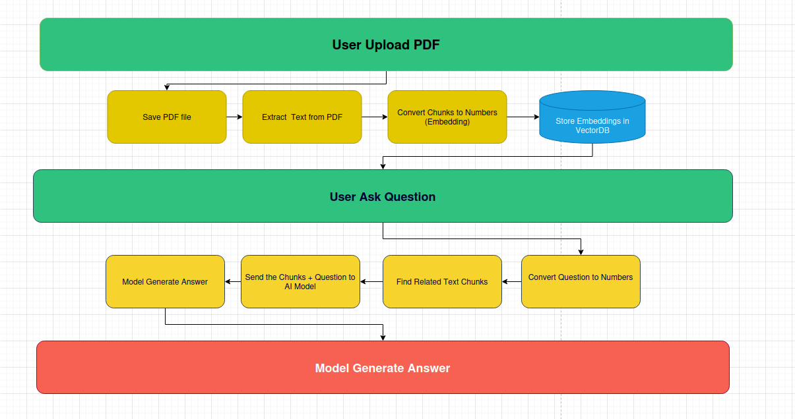

# PDF RAG Chatbot

This Streamlit application implements a **Retrieval-Augmented Generation (RAG) chatbot** that allows you to ask natural language questions about the content of your PDF documents.  
Instead of relying solely on a large language model's internal knowledge, this app retrieves relevant chunks of text from your uploaded PDFs and passes them to the model for context-aware answers.  

It’s useful for:  
- Extracting insights from research papers, books, or reports.  
- Summarizing specific sections of large documents.  
- Quickly finding answers without manually searching PDFs.  

---

## How It Works

The chatbot follows a **RAG pipeline**:  

1. **Document Upload** – You upload one or more PDF files into the app.  
2. **Text Extraction** – The PDFs are parsed, and text content is extracted.  
3. **Chunking** – The extracted text is split into smaller, semantically meaningful chunks.  
4. **Embedding Creation** – Each chunk is converted into a vector representation using an embedding model.  
5. **Vector Search** – When you ask a question, the app retrieves the most relevant chunks from the vector database.  
6. **Context-Aware Answer Generation** – The selected chunks are passed to the LLM to generate a precise, context-rich answer.  

**Pipeline Overview:**  
  

---

## Setup Instructions

### 1. Create and activate a Python virtual environment (venv)
```bash
python3 -m venv RAG
source venv/bin/activate     # On Linux/macOS
# or
.\venv\Scripts\activate      # On Windows PowerShell
